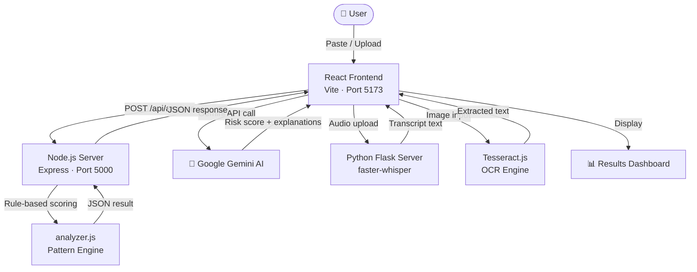
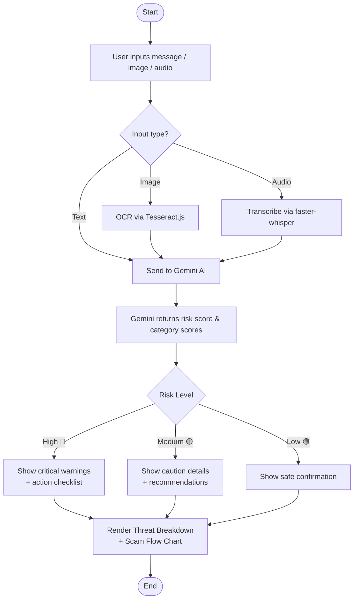

# 🛡️ NeuroShield

**NeuroShield** is an AI-powered scam detection web application that helps users identify "digital arrest" scams and other online fraud. It combines a **Google Gemini AI** analysis engine with a **rule-based Node.js backend** to give deep, context-aware risk assessments of suspicious messages.

---

## ✨ Features

- 🤖 **AI-Powered Analysis** — Uses Google Gemini AI for context-aware scam detection
- 📋 **Rule-Based Fallback** — Node.js backend with keyword/pattern matching for offline analysis
- 🎙️ **Audio Transcription** — Python/Flask server using `faster-whisper` to transcribe voice messages
- 📊 **Visual Threat Breakdown** — Charts and flow visualizations for detected threat categories
- ✅ **Action Checklist** — Personalized safety recommendations based on risk score
- 📷 **OCR Support** — Tesseract.js integration to extract text from screenshot images
- 🌐 **Responsive UI** — Built with React + Vite

---

## 🏗️ System Architecture



---

## 🗂️ Project Structure

```
NeuroShield/
├── client/                  # React + Vite frontend
│   ├── src/
│   │   ├── components/      # UI components (Scanner, Results, Charts, etc.)
│   │   ├── App.jsx          # Main application logic
│   │   └── index.css        # Global styles
│   ├── .env.example         # Environment variable template
│   └── vite.config.js       # Vite configuration
│
├── server/                  # Node.js + Express backend
│   ├── server.js            # REST API entry point
│   ├── analyzer.js          # Rule-based scam analysis engine
│   ├── audio_server.py      # Python/Flask audio transcription server
│   └── requirements.txt     # Python dependencies
│
└── package.json             # Root package (tesseract.js)
```

---

## 🚀 Getting Started

### Prerequisites

- [Node.js](https://nodejs.org/) v18+
- [Python](https://www.python.org/) 3.9+
- A [Google Gemini API key](https://aistudio.google.com/app/apikey) *(for AI analysis)*

---

### 1. Clone the Repository

```bash
git clone https://github.com/Vinay-Eligeti/NeuroShield.git
cd NeuroShield
```

---

### 2. Set Up the Client (Frontend)

```bash
cd client
npm install
```

Create a `.env` file from the template:

```bash
cp .env.example .env
```

Edit `.env` and add your Gemini API key:

```env
VITE_GROQ_API_KEY=your_gemini_api_key_here
```

Start the development server:

```bash
npm run dev
```

The frontend will be available at `http://localhost:5173`.

---

### 3. Set Up the Node.js Server (Backend)

```bash
cd server
npm install
npm run dev
```

The API will be available at `http://localhost:5000`.

| Endpoint | Method | Description |
|---|---|---|
| `/api/health` | GET | Health check |
| `/api/analyze` | POST | Analyze a message for scam indicators |

---

### 4. Set Up the Audio Transcription Server *(Optional)*

```bash
cd server
pip install -r requirements.txt
python audio_server.py
```

This starts a Flask server that transcribes audio/voice messages using `faster-whisper`.

---

## 🔧 Environment Variables

| Variable | Location | Description |
|---|---|---|
| `VITE_GROQ_API_KEY` | `client/.env` | Google Gemini API key for AI analysis |

---

## 🛠️ Tech Stack

| Layer | Technology |
|---|---|
| Frontend | React 18, Vite, Chart.js, React Router |
| Backend | Node.js, Express |
| AI Engine | Google Gemini API |
| Audio | Python, Flask, faster-whisper |
| OCR | Tesseract.js |

---

## 🔍 Analysis Flow



---

## 📄 License

This project is for educational purposes as part of a final project submission.
